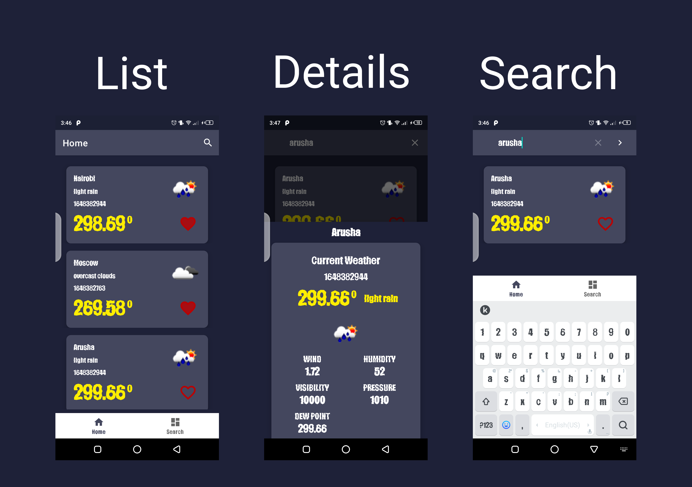

# interview_weather_app

## Data Sources
## [Open Weather Api: ](https://openweathermap.org/) - Network Data source.
## [ city list here: ](http://web.archive.org/web/20180619015316/http://openweathermap.org/help/city_list.txt) - A list of cities to pick from

## About
- This project is created with code re-usability, a screaming architecture, some other paradigms like
single responsibility, repository pattern, local caching, MVVM and dependency injection mind.
- More importantly, the project also leverages some of kotlin's more exciting features, like the use
 of extension functions, sealed classes, lambdas functions, coroutines, flow and so on.

## Built Using 🛠
- [Kotlin](https://kotlinlang.org/) - First class and official programming language for Android
development.
- [ViewBinding](https://developer.android.com/topic/libraries/view-binding) - Generates a binding
  class for each XML layout file present in that module and allows you to more easily write code that
  interacts with views.
- [Room DB](https://square.github.io/retrofit/) - Used to locally store our data.
- [Dagger Hilt](https://dagger.dev/hilt/) - For dependency injection.
- [Data Binding](https://dagger.dev/hilt/) - Used especially to bind data to the recyclerview.
- [Material Design](https://dagger.dev/hilt/) - Core design principles used to design the application.
- [Navigation Component](https://dagger.dev/hilt/) - Navigation system through the app.
- [Android Studio](https://dagger.dev/hilt/) - Arctic fox 2020.3.1

## FEATURES
- A screen displaying a list of current temperatures from 20 cities
- A search bar for filtering these cities
- Items from the list can be able to be made a favorite, favourite cities should go to the top of the list
- Clicking on the items should open an item screen displaying more detailed info of weather in that city
- Please ensure the app works gracefully in and out of internet activity

## TODO'S
- Remove extra 
- Add unit tests more tests.
- Clean dependencies in the app gradle file.
- Clean out all unused classes/ files (CLEAN UP)
- DRY the app a bit more.
- A notification showing the current conditions of a favorite city at the top of the hour (when the app is not in the foreground)

## How to use this project
- Fork project
- Clone this repo into android studio.
- Build & Run the app.

## Click the image below to watch how it works.

## Contact
If you need any help, you can connect with me.

Visit:- [maku](https://www.linkedin.com/in/maku-mazakpe-700a3a165/)
